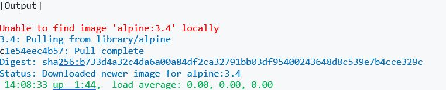

In this session we are going to learn few Container Operation commands

  * Creating, Starting, Stopping, Renaming, Removing Containers 
  * Inspacting Containers
  * Port Mapping for Docker  
  * Limiting Rrsoruces Memory and CPU
  * Prioritizing CPU Utilization


## Launching first container
```bash
docker run alpine:3.4 uptime

```



Try to understand the output

This command perform several steps:
* Checked is alpine image available locally? Answer no
* Pulled the alpine image file from docker hub. 
* Start the alpine container and Launch a program called uptime inside that container
* print output to the terminal
* Program is exited, deleted the container

### To Check the running container
```
docker container  ps

docker container  ps -l
```

### To check the exited container(s)
```
docker ps -a
```

### Running Containers in Interactive Mode

You can run a container with Interactive mode by using -i -t flags at the run time 
#### Meaning 
-i --> Interactive

-t --> tty

```bash
docker run -it alpine sh
```

[OUTPUT]


