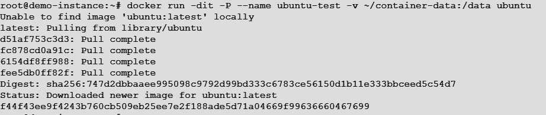
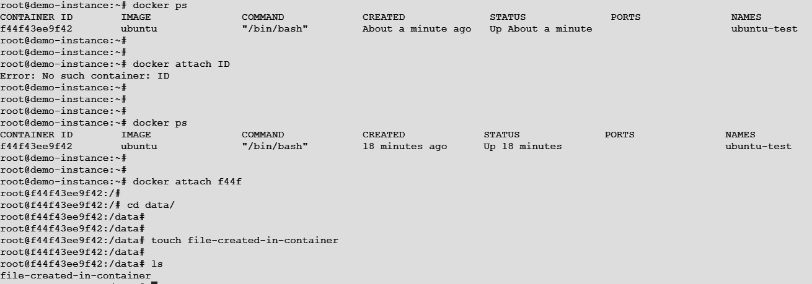
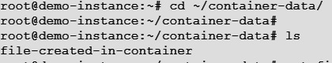
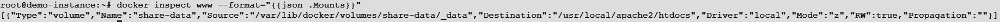
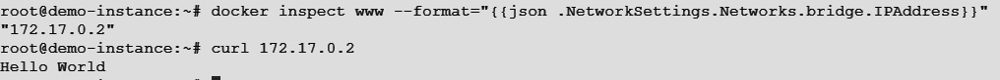
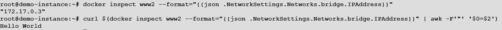
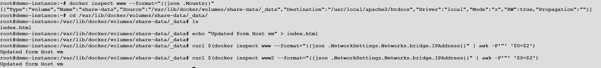
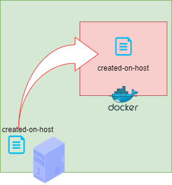

## Docker Images
In this session we are goin to learn about:

* Introduction to Docker Images
* Building a Docker Image with a Dockerfile
* Sharing Data in Your Docker Host with Containers
* Sharing Data Between Containers
* Copying Data to and from Containers
* Creatoing Docker Hub Account.
* Building Images using DockerFile.
* Pull and Push Images From/To Docker Hub.

### Introduction to Docker Images and Layer

A Docker image is a file, which consist of multiple layers that is used to execute code in a Docker container. 
An image is essentially built from the instructions for a complete and executable version of an application, which relies on the host OS kernel. When the Docker user runs an image, it can create one or more containers.

A Docker image includes the elements needed to run an application as a container -- such as code, config files, environment variables, libraries and run time. If the image is deployed to a Docker environment it can then be executed as a Docker container. The docker run command will create a container from a given image.


### Building a Docker Image with a Dockerfile
- Create a file loop.sh and append the below lines.

```bash
#!/bin/bash

loop(){
count=1
#a=3
a=$1
while [ "$count" -le $a ]; do

echo -e "Running endless loop: $count\n"
echo $cunt
sleep 1
((count++))
#clear
done
}


###
# Main body of script starts here
###
if [ "$1" = loop ];
then
shift
loop $1
else
echo -e "not a valid agrument\n"
echo -e "example: loop.sh loop"
fi
```
- Create a file i.e Dockerfile and append below code

```Dockerfile
FROM alpine
MAINTAINER Subrat Kumar
RUN apk update && apk add bash
COPY loop.sh .
ENTRYPOINT ["/bin/bash", "loop.sh"]
```

### Some docker image commands
- **docker image build:**       Builds an image from a Dockerfile.
- **docker image inspect:**     Displays information on one or more images.
- **docker image load:**        Loads an image from a tar archive or streams for receiving or reading input (STDIN).
- **docker image prune:**       Removes unused images.
- **docker image pull:**        Pulls an image or a repository from a registry.
- **docker image push:**        Pushes an image or a repository to a registry.
- **docker image rm:**          Removes one or more images.
- **docker image save:**        Saves one or more images to a tar archive (streamed to STDOUT by default).
- **docker image tag:**         Creates a tag TARGET_IMAGE that refers to SOURCE_IMAGE.


### Sharing Data in Your Docker Host with Containers

Once deployed, your containers are limited in how they can save and contain data. The limitation lies within the container filesystem. Docker containers make use of the Union File System (UFS), which works with a series of read-only layers that includes a final read-write layer on top. This system functions perfectly when a container doesn’t need to save data. But when you need to deploy a service that requires the ability to save data (such as an application that works with a database), what do you do?

- ### Welcome to Volumes

    A Docker volume is a directory (or collection of files) that lives on the host file system and is not a part of the container’s UFS.    It is within these volumes that containers are capable of saving data. With the docker volume command, you can easily manage volumes   to expand your containers well beyond their basic capability

- ### Creating the Host Data Volume
    The first step is to create a new directory to house the volume. To do this, open a terminal window and issue the command:
    ```
    mkdir ~/container-data
    ```
    **Note:You must ensure the newly-created directory is housed in a location the Docker user can access (with read-write privilege).**    

    Once you’ve created that directory, you’re ready to mount a volume inside. Let’s say you’re going to deploy 
    a container, based on the official Ubuntu image, that contains a directory called /data. 
    To deploy such a container that attaches the internal /data directory to a volume within the host directory 
    ~/container-data, you would issue the command:

    ```
    docker run -dit -P --name ubuntu-test -v ~/container-data:/data ubuntu
    ```
    The above command breaks down like this:

    - **docker run**___is the main command that says we’re going to run a command in a new container.
    - **-dit**___________is d for detached mode, and it ensures that bash or sh can be allocated to a pseudo terminal.
    - **-P**  ____________publishes the containers ports to the host.
    - **–name**________says what follows is the name of the new container.
    - **-v**_____________says what follows is to be the volume.
    - **ubuntu**_______is the image to be used for the container.

    <br></br>

- ### Testing the Volume
    Let’s test this volume. If you’ve forgotten the ID of the container, issue the **docker ps** command and copy first 4 charatcters from the containder ID

    ```
    docker attach ID #Replace ID with correct docker ID
    ```
    Once you attach to the container go to **/data** and create a file.  

    <br></br> 

    Now exit from the container and navigate to the directory which you creatd on the docker host i.e. **~/container-data**. 
    Check is ther any file exist or not?
    
    <br></br> 

### Sharing Data Between Containers
In general, Docker containers are ephemeral. By default, any data created inside the container is only available from within the container and only while the container is running. Docker volumes can be used to share files between a host system and the Docker container.

- ### Adding Volumes to Containers and Sharing Volumes Between Containers:
    Now we are going to create a simple Docker container from the **httpd:2.4** Docker image for running Apache 2 webserver. Then we are going to mount the **share-data** volume to /usr/local/apache2 /htdocs directory of that Docker container. We will give the container a name **www** just to easily manage it.

    ```
    docker run -d -it --name=www --mount source=share-data,destination=/usr/local/apache2/htdocs httpd:2.4
    ```
    Now to check whether the share-data volume was mounted to the www container or not?  
    run the following command:

    ```
    docker inspect www --format="{{json .Mounts}}"
    ```
    <br></br>
    
    Now connect to the www container and create a **index.html** file.

    ```
    docker exec -it www bash

    echo "Hello World" > /usr/local/apache2/htdocs/index.html

    exit
    ```

    Now find out the IP address of the www container with the below command and accss the apache2 service:
    
    ```
    docker inspect www --format="{{json .NetworkSettings.Networks.bridge.IPAddress}}"

    curl $(docker inspect www --format="{{json .NetworkSettings.Networks.bridge.IPAddress}}" | awk -F'"' '$0=$2')
    ```
    <br></br>


    Now let's create another container **www2** and attach the **share-data** volume to it the same way and see if the changes to the share-data volume (mounted in /usr/local/apache2/htdocs in www and www2 container) from one container is visible to the other container.

    To create a new container www2, and attach the share-data volume to it, run the below command:

    ```
    docker run -d -it --name=www2 --mount source=share-data,destination=/usr/local/apache2/htdocs httpd:2.4

    #Now let’s find the IP address of the www2 container with the following command:

    docker inspect www2 --format="{{json .NetworkSettings.Networks.bridge.IPAddress}}"

    ```
    <br></br>

    Now navigate to the volume on which both the container are mounted to and update the **index.html** file.

    <br></br>

### Copying Data to and from Containers
- ### Copying Data to Container
    In order to copy data to container execute the below command.
    
    ```
    touch creatd-on-host-vm
    
    docker cp created-on-host-vm www:/tmp

    docker exec -it www bash -c 'ls -lrth /tmp'
    ```
    <br></br>


- ### Copying Data from container
    In order to copy data from container execute the below command.
    
    ```
    docker exec -it www bash -c "touch /tmp/created-on-container"

    docker exec -it www bash -c "ls /tmp/"

    docker cp www:/tmp/created-on-container .
    
    ls
    ```
    <br></br>

    

