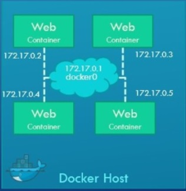

### Docker Networking
When you Install the Docker by default docker create three Networks
- Bridge
- Host
- None

**Note: Bridge is the default network that a container can attach to.**

Examples:
```
docker run -itd ubuntu  #Auto assign Bridge network


docker run -itd --network=host ubuntu   #Creata a hostonly netwotrk and assign the IP address to container


docker run -itd --network=none ubunut   #No network will assign to container

```

- ### Bridge Network
  Bridge network is a private network create by the Docker in the docker host, all created container(s) attach bydefault and they get an Internal IP Address in the range 172.17.0.0 series.

  A container can reach to another with Internal IP address if required. To access the container outside world map the ports of the Containers to the Ports on the Docker host.

   


