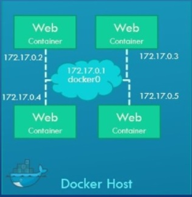

### Docker Networking
When you Install the Docker by default docker create three Networks
- Bridge
- Host
- None

**Note: Bridge is the default network that a container can attach to.**

Examples:
```
docker run -itd ubuntu  #Auto assign Bridge network


docker run -itd --network=host ubuntu   #Creata a hostonly netwotrk and assign the IP address to container


docker run -itd --network=none ubunut   #No network will assign to container

```

- ### Bridge Network
Bridge network is a private network create by the Docker in the docker host, all created container(s) attach bydefault and they getan Internal IP Address in the range 172.17.0.0 series.
A container can reach to another with Internal IP address if required. To access the container outside world map the ports of theContainers to the Ports on the Docker host.


- ### Host Network
For standalone containers, remove network isolation between the container and the Docker host, and use the host’s networkingdirectly. host is only available for swarm services on Docker 17.06 and higher. See [use the host network](https://docs.docker.comnetwork/host/).  
The --net=host option is used to make the programs inside the Docker container look like they are running on the host itself, fromthe perspective of the network. It allows the container greater network access than it can normally get.

Normally you have to forward ports from the host machine into a container, but when the containers share the host's network, any network activity happens directly on the host machine - just as it would if the program was running locally on the host instead of inside a container.

While this does mean you no longer have to expose ports and map them to container ports, it means you have to edit your Dockerfiles to adjust the ports each container listens on, to avoid conflicts as you can't have two containers operating on the same host port. However, the real reason for this option is for running apps that need network access that is difficult to forward through to a container at the port level. 

Generally speaking, --net=host is only needed when you are running programs with very specific, unusual network needs.

Example:
```
docker run --rm -d  --name my_httpd httpd
```
Try to access the http UI with port number 80.

```
docker run --rm -d --network host --name my_httpd httpd
```
Now, try to access the httpd service with port 80.

### Networking with standalone containers
This series of tutorials deals with networking for standalone Docker containers.
This topic includes two different tutorials

- Use the default **bridge** network demonstrates how to use the default bridge network that Docker sets up for you automatically. This    network is not the best choice for production systems.

- Use **user-defined bridge** networks shows how to create and use your own custom bridge networks, to connect containers running on the same Docker host. This is recommended for standalone containers running in production.

### Use the default bridge network
In this example, you start two different alpine containers on the same Docker host and do some tests to understand how they communicate with each other. You need to have Docker installed and running.

```
#To list available networks
docker network ls
```
Start two alpine containers running ash, which is Alpine’s default shell rather than bash. The -dit flags mean to start the container detached (in the background), interactive (with the ability to type into it), and with a TTY (so you can see the input and output). Since you are starting it detached, you won’t be connected to the container right away. Instead, the container’s ID will be printed. Because you have not specified any --network flags, the containers connect to the default bridge network.

```
docker run -dit --name alpine1 alpine ash

docker run -dit --name alpine2 alpine ash
```

Check that both containers are actually started:

```
docker ps
```
Inspect the bridge network to see what containers are connected to it.

```
docker network inspect bridge
```

[Output]

```json
[
    {
        "Name": "bridge",
        "Id": "7e036800a97c8150206d570d6b781c1f9e3e99392533f01dc411eff760a49cdc",
        "Created": "2020-05-28T14:20:12.071483312Z",
        "Scope": "local",
        "Driver": "bridge",
        "EnableIPv6": false,
        "IPAM": {
            "Driver": "default",
            "Options": null,
            "Config": [
                {
                    "Subnet": "172.17.0.0/16",
                    "Gateway": "172.17.0.1"
                }
            ]
        },
        "Internal": false,
        "Attachable": false,
        "Ingress": false,
        "ConfigFrom": {
            "Network": ""
        },
        "ConfigOnly": false,
        "Containers": {
            "3485a425ed17ede9bec0bdfb9b971508042afc2e6c78ba3751b821e3e3004a98": {
                "Name": "alpine2",
                "EndpointID": "497729c65ae1a929d6eee8ce024115e103b114973578b05fa9ed9cd945511c32",
				"MacAddress": "02:42:ac:11:00:03",
                "IPv4Address": "172.17.0.3/16",
                "IPv6Address": ""
            },
            "5788f74fdc59f95ced36d908245b923cd940ed5917ae4a464ea42c7a135be21c": {
                "Name": "alpine1",
                "EndpointID": "663581b9cd9cc26fcd3d091257d2e4ce4fbb54d3ae05732a48877492f64aa539",
                "MacAddress": "02:42:ac:11:00:02",
                "IPv4Address": "172.17.0.2/16",
                "IPv6Address": ""
            }
        },
        "Options": {
            "com.docker.network.bridge.default_bridge": "true",
            "com.docker.network.bridge.enable_icc": "true",
            "com.docker.network.bridge.enable_ip_masquerade": "true",
            "com.docker.network.bridge.host_binding_ipv4": "0.0.0.0",
            "com.docker.network.bridge.name": "docker0",
            "com.docker.network.driver.mtu": "1500"
        },
        "Labels": {}
    }
]
```
Under the Containers key, each connected container is listed, along with information about its IP address (172.17.0.2 for alpine1 and 172.17.0.3 for alpine2).

The containers are running in the background. Use the docker attach command to connect to alpine1.

```
docker attach alpine1
```
Use the **ip addr show** command to show the network interfaces for alpine1 as they look from within the container:

```bash
ip addr show
```

[Output]

```
1: lo: <LOOPBACK,UP,LOWER_UP> mtu 65536 qdisc noqueue state UNKNOWN qlen 1000
    link/loopback 00:00:00:00:00:00 brd 00:00:00:00:00:00
    inet 127.0.0.1/8 scope host lo
       valid_lft forever preferred_lft forever
251: eth0@if252: <BROADCAST,MULTICAST,UP,LOWER_UP,M-DOWN> mtu 1500 qdisc noqueue state UP 
    link/ether 02:42:ac:11:00:02 brd ff:ff:ff:ff:ff:ff
    inet 172.17.0.2/16 brd 172.17.255.255 scope global eth0
       valid_lft forever preferred_lft forever
```
Notice that the second interface has the IP address 172.17.0.2, which is the same address shown for alpine1 in the previous step.

From within alpine1, make sure you can connect to the internet by pinging google.com. The -c 2 flag limits the command to two ping attempts.

```
ping -c 2 google.com

```
[Output]
```
PING google.com (172.217.212.102): 56 data bytes
64 bytes from 172.217.212.102: seq=0 ttl=51 time=0.929 ms
64 bytes from 172.217.212.102: seq=1 ttl=51 time=1.005 ms

--- google.com ping statistics ---
2 packets transmitted, 2 packets received, 0% packet loss
round-trip min/avg/max = 0.929/0.967/1.005 ms
```

Now try to ping the second container. First, ping it by its IP address, 172.17.0.3

[Output]
```
PING 172.17.0.3 (172.17.0.3): 56 data bytes
64 bytes from 172.17.0.3: seq=0 ttl=64 time=0.165 ms
64 bytes from 172.17.0.3: seq=1 ttl=64 time=0.111 ms

--- 172.17.0.3 ping statistics ---
2 packets transmitted, 2 packets received, 0% packet loss
round-trip min/avg/max = 0.111/0.138/0.165 ms
```
This succeeds. Next, try pinging the alpine2 container by container name. This will fail.

```
ping -c 2 alpine2
```

[Output]

```
ping: bad address 'alpine2'
```

Detach from alpine1 without stopping it by using the detach sequence, CTRL + p CTRL + q.

do the above steps for alpine2 container to check. substituting alpine1 for alpine2

### Use user-defined bridge networks
In this example, we again start two alpine containers, but attach them to a user-defined network called alpine-net which we have already created. These containers are not connected to the default bridge network at all. We then start a third alpine container which is connected to the bridge network but not connected to alpine-net, and a fourth alpine container which is connected to both networks.

1. Create the alpine-net network. You do not need the --driver bridge flag since it’s the default, but this example shows how to specify it.

```
docker network create --driver bridge alpine-net
```
2. List Docker’s networks:

```
docker network ls

```

Inspect the alpine-net network. This shows you its IP address and the fact that no containers are connected to it:

```
docker network inspect alpine-net
```

[Output]

```json
[
    {
        "Name": "alpine-net",
        "Id": "277108d1cd45d13a5037935429e6d26e84070b067c7c599085e9b875cb5d2751",
        "Created": "2020-05-28T16:28:49.008235503Z",
        "Scope": "local",
        "Driver": "bridge",
        "EnableIPv6": false,
        "IPAM": {
            "Driver": "default",
            "Options": {},
            "Config": [
                {
                    "Subnet": "172.18.0.0/16",
                    "Gateway": "172.18.0.1"
                }
            ]
        },
        "Internal": false,
        "Attachable": false,
        "Ingress": false,
        "ConfigFrom": {
            "Network": ""
        },
        "ConfigOnly": false,
        "Containers": {},
        "Options": {},
        "Labels": {}
    }
]
```

**Notice that this network’s gateway is 172.18.0.1, as opposed to the default bridge network, whose gateway is 172.17.0.1. The exact IP address may be different on your system.**

3. Create your four containers. Notice the --network flags. You can only connect to one network during the docker run command, so you need to use docker network connect afterward to connect alpine4 to the bridge network as well.

```
docker run -dit --name alpine1 --network alpine-net alpine ash

docker run -dit --name alpine2 --network alpine-net alpine ash

docker run -dit --name alpine3 alpine ash

docker run -dit --name alpine4 --network alpine-net alpine ash

docker network connect bridge alpine4
```

Verify that all containers are running:

```
docker ps
```

[Output]

```
CONTAINER ID        IMAGE               COMMAND             CREATED             STATUS              PORTS               NAMES
1f1e4b819f32        alpine              "ash"               16 seconds ago      Up 15 seconds                           alpine4
6138995a3550        alpine              "ash"               22 seconds ago      Up 21 seconds                           alpine3
1b1b1ca34d15        alpine              "ash"               28 seconds ago      Up 26 seconds                           alpine2
19573860f677        alpine              "ash"               37 seconds ago      Up 36 seconds                           alpine1
```
4. Inspect the bridge network and the alpine-net network again:

```
docker network inspect bridge
```

[Output]

```json
[
    {
        "Name": "bridge",
        "Id": "7e036800a97c8150206d570d6b781c1f9e3e99392533f01dc411eff760a49cdc",
        "Created": "2020-05-28T14:20:12.071483312Z",
        "Scope": "local",
        "Driver": "bridge",
        "EnableIPv6": false,
        "IPAM": {
            "Driver": "default",
            "Options": null,
            "Config": [
                {
                    "Subnet": "172.17.0.0/16",
                    "Gateway": "172.17.0.1"
                }
            ]
        },
        "Internal": false,
        "Attachable": false,
        "Ingress": false,
        "ConfigFrom": {
            "Network": ""
        },
        "ConfigOnly": false,
        "Containers": {
            "1f1e4b819f3292a13d7056156174ed00c75fed2a3b24212f4bc3f1fb14b9c7da": {
                "Name": "alpine4",
                "EndpointID": "ea52463033c4de37300b42a6f0cd6eaf064e1445c6172fd611d344153d249520",
                "MacAddress": "02:42:ac:11:00:03",
                "IPv4Address": "172.17.0.3/16",
                "IPv6Address": ""
            },
            "6138995a3550432c1fe05875075ed958937a198a71797b3c03d1dca304c08e39": {
                "Name": "alpine3",
                "EndpointID": "13e1e7d3776755d65f6308d7390aac322b41bf2844be060793e9e8c37f13864b",
                "MacAddress": "02:42:ac:11:00:02",
                "IPv4Address": "172.17.0.2/16",
				"IPv6Address": ""
            }
        },
        "Options": {
            "com.docker.network.bridge.default_bridge": "true",
            "com.docker.network.bridge.enable_icc": "true",
            "com.docker.network.bridge.enable_ip_masquerade": "true",
            "com.docker.network.bridge.host_binding_ipv4": "0.0.0.0",
            "com.docker.network.bridge.name": "docker0",
            "com.docker.network.driver.mtu": "1500"
        },
        "Labels": {}
    }
]
```
**Note: Containers alpine3 and alpine4 are connected to the bridge network.**

```
docker network inspect alpine-net
```

[Output]

```json
[
    {
        "Name": "alpine-net",
        "Id": "277108d1cd45d13a5037935429e6d26e84070b067c7c599085e9b875cb5d2751",
        "Created": "2020-05-28T16:28:49.008235503Z",
        "Scope": "local",
        "Driver": "bridge",
        "EnableIPv6": false,
        "IPAM": {
            "Driver": "default",
            "Options": {},
            "Config": [
                {
                    "Subnet": "172.18.0.0/16",
                    "Gateway": "172.18.0.1"
                }
            ]
        },
        "Internal": false,
        "Attachable": false,
        "Ingress": false,
        "ConfigFrom": {
            "Network": ""
        },
        "ConfigOnly": false,
        "Containers": {
            "19573860f677491c71263845fe1ac9cd280094117bac52c01ce1afeec4da4338": {
                "Name": "alpine1",
                "EndpointID": "d1075fa70d099fe646ad46eea7e35293d12244a98e63f3c84f45a0c59d150cd2",
                "MacAddress": "02:42:ac:12:00:02",
                "IPv4Address": "172.18.0.2/16",
                "IPv6Address": ""
            },
            "1b1b1ca34d15c6ee880ca622ba7cb631d3c78446bf9922788b309d005b92ba8a": {
                "Name": "alpine2",
                "EndpointID": "7f4dd9c2347b5689728e4f7f1ee9c0de8ae58b4685e9e14baac1052dd313fdd9",
                "MacAddress": "02:42:ac:12:00:03",
				"IPv4Address": "172.18.0.3/16",
                "IPv6Address": ""
            },
            "1f1e4b819f3292a13d7056156174ed00c75fed2a3b24212f4bc3f1fb14b9c7da": {
                "Name": "alpine4",
                "EndpointID": "98837b67f39f5b4b19cd6bbeb75f21d76a8b60d147e1a6ad23f3f846b0e30baf",
                "MacAddress": "02:42:ac:12:00:04",
                "IPv4Address": "172.18.0.4/16",
                "IPv6Address": ""
            }
        },
        "Options": {},
        "Labels": {}
    }
]
```
Containers alpine1, alpine2, and alpine4 are connected to the alpine-net network.

5. On user-defined networks like alpine-net, containers can not only communicate by IP address, but can also resolve a container name to an IP address. This capability is called automatic service discovery. Let’s connect to alpine1 and test this out. alpine1 should be able to resolve alpine2 and alpine4 (and alpine1, itself) to IP addresses.

```
docker container attach alpine1

ping -c 2 alpine2

ping -c 2 alpine4

ping -c 2 alpine1
```
[Output]
```
PING alpine2 (172.18.0.3): 56 data bytes
64 bytes from 172.18.0.3: seq=0 ttl=64 time=0.302 ms
64 bytes from 172.18.0.3: seq=1 ttl=64 time=0.097 ms

--- alpine2 ping statistics ---
2 packets transmitted, 2 packets received, 0% packet loss
round-trip min/avg/max = 0.097/0.199/0.302 ms
```
```
PING alpine4 (172.18.0.4): 56 data bytes
64 bytes from 172.18.0.4: seq=0 ttl=64 time=0.144 ms
64 bytes from 172.18.0.4: seq=1 ttl=64 time=0.093 ms

--- alpine4 ping statistics ---
2 packets transmitted, 2 packets received, 0% packet loss
round-trip min/avg/max = 0.093/0.118/0.144 ms
```

```
PING alpine1 (172.18.0.2): 56 data bytes
64 bytes from 172.18.0.2: seq=0 ttl=64 time=0.053 ms
64 bytes from 172.18.0.2: seq=1 ttl=64 time=0.070 ms

--- alpine1 ping statistics ---
2 packets transmitted, 2 packets received, 0% packet loss
round-trip min/avg/max = 0.053/0.061/0.070 ms
```
6. From alpine1, you should not be able to connect to alpine3 at all, since it is not on the alpine-net network.

```
ping -c 2 alpine3
```

[Output]
```
ping: bad address 'alpine3'
```
Not only that, but you can’t connect to alpine3 from alpine1 by its IP address either. Look back at the docker network inspect output for the bridge network and find alpine3’s IP address: 172.17.0.2 Try to ping it.

```
ping -c 2 172.17.0.2
```
[Output]

```
PING 172.17.0.2 (172.17.0.2): 56 data bytes

--- 172.17.0.2 ping statistics ---
2 packets transmitted, 0 packets received, 100% packet loss
```

7. Remember that alpine4 is connected to both the default bridge network and alpine-net. It should be able to reach all of the other containers. However, you will need to address alpine3 by its IP address. Attach to it and run the tests.

```
docker container attach alpine4

ping -c 2 alpine1

ping -c 2 alpine2

ping -c 2 alpine3

ping -c 2 172.17.0.2

ping -c 2 alpine4
```

[Output]

```
# ping -c 2 alpine1

PING alpine1 (172.18.0.2): 56 data bytes
64 bytes from 172.18.0.2: seq=0 ttl=64 time=0.074 ms
64 bytes from 172.18.0.2: seq=1 ttl=64 time=0.082 ms

--- alpine1 ping statistics ---
2 packets transmitted, 2 packets received, 0% packet loss
round-trip min/avg/max = 0.074/0.078/0.082 ms

# ping -c 2 alpine2

PING alpine2 (172.18.0.3): 56 data bytes
64 bytes from 172.18.0.3: seq=0 ttl=64 time=0.075 ms
64 bytes from 172.18.0.3: seq=1 ttl=64 time=0.080 ms

--- alpine2 ping statistics ---
2 packets transmitted, 2 packets received, 0% packet loss
round-trip min/avg/max = 0.075/0.077/0.080 ms

# ping -c 2 alpine3
ping: bad address 'alpine3'

# ping -c 2 172.17.0.2

PING 172.17.0.2 (172.17.0.2): 56 data bytes
64 bytes from 172.17.0.2: seq=0 ttl=64 time=0.089 ms
64 bytes from 172.17.0.2: seq=1 ttl=64 time=0.075 ms

--- 172.17.0.2 ping statistics ---
2 packets transmitted, 2 packets received, 0% packet loss
round-trip min/avg/max = 0.075/0.082/0.089 ms

# ping -c 2 alpine4

PING alpine4 (172.18.0.4): 56 data bytes
64 bytes from 172.18.0.4: seq=0 ttl=64 time=0.033 ms
64 bytes from 172.18.0.4: seq=1 ttl=64 time=0.064 ms

--- alpine4 ping statistics ---
2 packets transmitted, 2 packets received, 0% packet loss
round-trip min/avg/max = 0.033/0.048/0.064 ms
```


