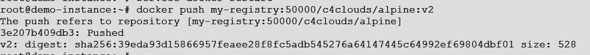

#### Let’s see what we are going to go learn in this article:

- Difference Between Docker Repository and Docker Registry More About Docker Hub
- Creating a Local Docker Registry
- Pushing images to a Local Docker Registry
- Use Cases for Local Docker Registry

### Difference Between Docker Repository and Docker Registry
Docker registry is an enterprise grade service for storing Images. We can use one of the existing and well-established cloud registries like Docker Hub, Quay, Google Container Registry, Amazon Elastic Container Registry or any other. We can also make our own registry and host it locally. We’re going to learn how to do that later on in this post. 

Docker Repository is a collection of Docker images with the same name and different tags. For example, the repository we’ve used several times so far, mcr.microsoft.com/dotnet/core/aspnet repository, has many different images in it.

- ### More About Docker Hub
    As we’ve mentioned, Docker Hub is just one of the registry providers. And a good one at that. We can find all sorts of images over there and push our own. We can create unlimited public repositories and one private repo free of charge. If you need more private repositories, you can choose one of the Docker Hub monthly plans.

    Besides providing a centralized resource for image discovery and distribution, Docker Hub’s functionality extends to:

    - Automated builds of images on source code changes and parallel builds
    - Webhooks on image creation and push
    - Groups and organizations management
    - GitHub and BitBucket integration

    To push the image from the local machine to Docker Hub we need to type docker login and enter the credentials of your account in the prompt. After that, you can easily push the image by typing docker push accountname/imagename:tag.


### Creating a Local Docker Registry
Docker Hub is super neat and very intuitive and offers a great deal of functionality for free.
But what if we need more privacy? Or our client wants to use its own server.

If that’s the case, we can make our own Docker Registry.

So how do we do that?

Well, we can set up the registry in two different ways:

- Directly with the Docker command
- Using Docker compose

    ### Directly with docker command
    Creating a local registry using docker is pretty straightforward and shouldn’t be such a big deal if you followed the docker series so far. The registry repository is located on the Docker Hub here. (heh, registry repository) Aren’t you glad now that we talked about the differences between these terms 🙂

    So if we want to set up the local registry we can type:

    ```
    #To Install the necessary packages
    apt-get install -y apt-transport-https software-properties-common ca-certificates curl -y

    #Pull the Registry Docker Image
    docker pull registry
    ```

    Once the registry image downloaded, you will need to generate a self-signed certificate for securing Docker Registry. Because, Docker node uses a secure connection over TLS to upload or download images to or from the private registry.

    Go to the registry-server and run the following command to generate certificate:

    ```bash
    mkdir /etc/certs
    cd /etc/certs
    openssl req -newkey rsa:4096 -nodes -sha256 -keyout ca.key -x509 -days 365 -out ca.crt
    ```

    [Output]
    ```
    Generating a 4096 bit RSA private key
    .........................++
    .........................................++
    writing new private key to 'ca.key'
    -----
    You are about to be asked to enter information that will be incorporated
    into your certificate request.
    What you are about to enter is what is called a Distinguished Name or a DN.
    There are quite a few fields but you can leave some blank
    For some fields there will be a default value,
    If you enter '.', the field will be left blank.
    -----
    Country Name (2 letter code) [AU]:IN
    State or Province Name (full name) [Some-State]:Karnataka
    Locality Name (eg, city) []:Bangalore
    Organization Name (eg, company) [Internet Widgits Pty Ltd]:c4clouds
    Organizational Unit Name (eg, section) []:IT
    Common Name (e.g. server FQDN or YOUR name) []:my-registry
    Email Address []:admin@c4clouds.com
    ```

    ```
    docker run -d -p 50000:5000\
    --restart always\
    --name my-registry\
    -v /etc/certs:/etc/certs\
    -e REGISTRY_HTTP_TLS_CERTIFICATE=/etc/certs/ca.crt\
    -e REGISTRY_HTTP_TLS_KEY=/etc/certs/ca.key registry
    ```

    Once the Docker image is ready on registry-client. Before starting, you will need to copy the ca.crt certificate from the registry-server to registry-client.

    **Note: In our case both Client/Server on same vm**

    ```bash
    mkdir -p /etc/docker/certs.d/my-registry:5000
    cp /etc/certs/ca.crt /usr/local/share/ca-certificates/
    docker cp my-registry:/etc/certs/ca.crt /etc/docker/certs.d/my-registry\:5000/
    ```

    Now, restart docker service with the following command:
    ```
    service docker restart
    ```

### Pushing Images to a Local Docker Registry
So now we have our own local registry. Let’s push some images to it.

```
docker push my-registry:50000/c4clouds/alpine:v2
```
[output]

Go to the registry-client instance and run the following command:

Now we can access the repository with **host-vm-ip:50000/v2/_catalog**

### output
```json
{
    repositories: [
        "c4clouds/alpine"
        ]
}
```
    
### Using Docker Compose

    Create a file i.e. **docker-compose.yml** and paste the below code

    ```dockerfile
    registry:
      image: registry:2
      ports:
        - 50000:5000
      environment:
        REGISTRY_HTTP_TLS_CERTIFICATE: /certs/ca.crt
        REGISTRY_HTTP_TLS_KEY: /certs/ca.key
        #REGISTRY_AUTH: htpasswd
        #REGISTRY_AUTH_HTPASSWD_PATH: /auth/registry.passwd
        #REGISTRY_AUTH_HTPASSWD_REALM: Registry Realm
      volumes:
        - /root/registry-volume:/var/lib/registry
        - /root/registry-volume:/certs
        #- /path/auth:/auth
    ```
Note: Create a directory i.e **/root/registry-volume** and copy the created sesfsigned SSL **ca.crt** and **ca.key** files to it. Copy the **ca.crt** file to **/usr/local/share/ca-certificates/** location then execute command **update-ca-certificates**

### Enable basic auth (username/password) for docker login
In order to test the basic auth Create a file i.e. registry.passwd for example-user

```
htpasswd -Bc /root/registry-volume/registry.passwd example-user
```

Now open the **docker-compose.yml** fil and remove the # mark for auth and execute below command:

```diff
docker-compose up -d 

curl https://my-registry:50000:/v2/_catalog

-[Output]

{"errors":[{"code":"UNAUTHORIZED","message":"authentication required","detail":[{"Type":"registry","Class":"","Name":"catalog","Action":"*"}]}]}

#Now with a valid username and password 

curl -u example-user:1234  https://my-registry:50000/v2/_catalog
-[Output]
{"repositories":["c4clouds/loop-with-number"]}
```

### Use Cases for Local Docker Registry
Now that you know pretty much everything you need to run a local registry, you might wonder: “But why should I use a localregistry when I have all those nice options available?”.
There are a few reasons for that:
- Total control of our registry and repositories
- We need to set up a local network and to easily distribute images throughout it, to save the bandwidth
- We have a closed network without internet access
- Setting up a local CI build server that uses that registry
- We don’t want to pay some crazy plans to cloud providers to host our repositories